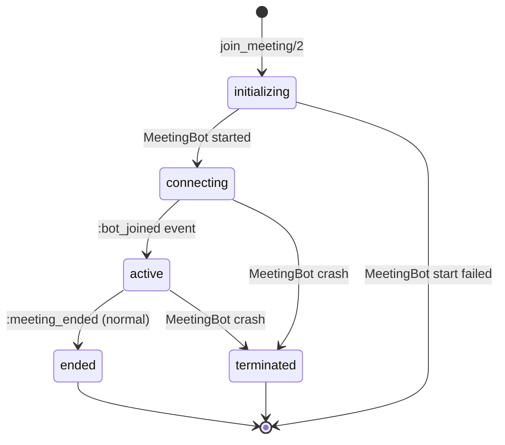

# Session Lifecycle

Each `ZoomGate.Session` GenServer manages the full lifecycle of a single
meeting bot. Sessions are created via `ZoomGate.join_meeting/2` and
supervised by `ZoomGate.SessionSupervisor` as `:temporary` children --
they are never automatically restarted.

## State Machine



### States

| State | Description |
|-------|-------------|
| `initializing` | Session GenServer started, MeetingBot process not yet spawned. |
| `connecting` | MeetingBot started, WebSocket connecting to Zoom RWG server. |
| `active` | Bot joined the meeting. The `:bot_joined` event has been emitted. |
| `ended` | Meeting ended normally. A `:meeting_ended` event was delivered. |
| `terminated` | MeetingBot process crashed. A `:meeting_ended` event with reason `:worker_exit` was delivered. |

## Startup Sequence

When `ZoomGate.join_meeting/2` is called:

1. `SessionSupervisor` starts a new `Session` GenServer (registered by meeting ID).
2. The Session enters `initializing` and immediately continues to start a `MeetingBot`.
3. If MeetingBot starts successfully, the Session transitions to `connecting` and monitors the MeetingBot process.
4. If MeetingBot fails to start, the Session stops with `{:error, {:meeting_bot_failed, reason}}`.
5. Once the bot joins the Zoom meeting, MeetingBot sends `{:meeting_bot_event, {:joined, _}}` and the Session transitions to `active`.

```elixir
{:ok, pid} = ZoomGate.join_meeting("123456789",
  sdk_key: "...",
  sdk_secret: "...",
  zak: "...",
  callback: self()
)

# Wait for the bot to join
receive do
  {:zoom_gate, {:bot_joined, %{meeting_id: "123456789"}}} ->
    IO.puts("Bot is active, commands are now accepted")
end
```

## When Commands Can Be Called

Commands (`admit`, `deny`, `rename`, `expel`, `send_chat`, etc.) are only
meaningful after the session reaches the `active` state. Calling a command
before the bot has joined will send a message to the MeetingBot, but the
Zoom RWG server will ignore it because the bot is not yet authenticated.

**Wait for the `:bot_joined` event** before sending commands.

## Participant ID Changes on Admit

When a user is admitted from the waiting room into the meeting, Zoom assigns
them a **new `zoom_user_id`**. The ID they had in the waiting room becomes
invalid.

The event sequence looks like this:

1. `:waiting_room_join` -- `%{zoom_user_id: 100, display_name: "Alice"}`
2. You call `ZoomGate.admit("meeting", 100)`
3. `:waiting_room_leave` -- `%{zoom_user_id: 100}`
4. `:participant_joined` -- `%{zoom_user_id: 200, display_name: "Alice"}`

The `zoom_user_id` changed from `100` to `200`. To track a user across this
transition, use the `zoom_id` field (derived from `strConfUserID` / `userGUID`)
which remains stable.

## Event Ordering

All events for a session are delivered through a single GenServer, so they are
**strictly ordered per session**. Events are delivered via four channels
simultaneously:

1. **Callback** -- direct `send/2` to the callback PID or `{module, function}` MFA
2. **PubSub** -- `Phoenix.PubSub.broadcast/3` on topic `"zoom_gate:MEETING_ID"`
3. **Subscribers** -- `send/2` to each subscribed PID (via `Session.subscribe/2`)
4. **Webhook** -- HTTP POST to the configured `webhook_url` (fire-and-forget)

## Command Serialization

All commands are serialized through the Session GenServer via `GenServer.call/2`.
This means:

- Commands execute in the order they are received.
- Each command completes (returns `:ok`) before the next is processed.
- The default `GenServer.call` timeout is 5000ms.

## Crash Behavior

The MeetingBot process is started with `GenServer.start/2` (not `start_link`)
and monitored by the Session. If the MeetingBot crashes:

1. The Session receives a `:DOWN` message.
2. It delivers `{:meeting_ended, %{reason: :worker_exit}}` to all subscribers.
3. The Session itself terminates with `{:meeting_bot_exited, reason}`.

Because sessions use `:temporary` restart strategy, the `SessionSupervisor`
will **not** restart the Session. The consuming application must call
`join_meeting/2` again to create a new session.

## Shutdown Sequence

### Normal end (meeting ended by host)

1. MeetingBot sends `{:meeting_bot_event, {:meeting_ended, %{reason: ...}}}`.
2. Session delivers the event and transitions to `ended`.
3. Session stops with `:normal` exit reason.

### Explicit leave

1. Caller invokes `ZoomGate.leave_meeting/1`.
2. `SessionSupervisor.terminate_child/2` is called.
3. Session's `terminate/2` callback tells MeetingBot to leave.
4. Session and MeetingBot shut down.

### MeetingBot crash

1. MeetingBot exits abnormally.
2. Session delivers `{:meeting_ended, %{reason: :worker_exit}}`.
3. Session transitions to `terminated` and stops.

## Observing Session State

You can query the current state of any active session:

```elixir
ZoomGate.Session.get_status("123456789")
# => %{
#   meeting_id: "123456789",
#   status: :active,
#   participants: %{200 => %{zoom_user_id: 200, display_name: "Alice", ...}},
#   waiting_room: %{300 => %{zoom_user_id: 300, display_name: "Bob", ...}}
# }
```

Via REST:

```bash
curl http://localhost:4000/api/sessions/123456789
```

Via WebSocket (Phoenix Channel):

```javascript
channel.push("get_status", {}).receive("ok", (status) => console.log(status))
```
