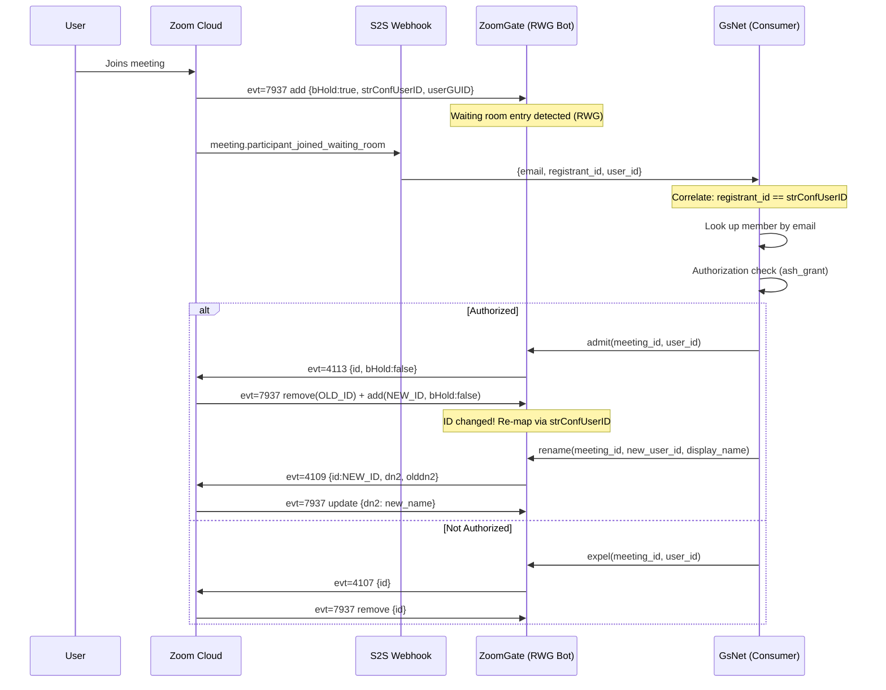

# Webhook + RWG Integration Guide

ZoomGate receives events from two sources simultaneously during an active meeting session. Understanding how these sources complement each other is critical for building reliable participant identity resolution and waiting room automation.

## Event Sources

### 1. RWG WebSocket (Real-time, In-Meeting)

The RWG (Real-time Web Gateway) connection provides sub-second event delivery for all in-meeting actions: participant roster changes, chat messages, sharing state, audio/video status, and meeting settings. This is the same protocol the Zoom Web SDK uses internally.

- **Latency**: 50-200ms typical
- **Data**: Roster fields (id, dn2, bHold, strConfUserID, userGUID, sdkKey, etc.)
- **Limitation**: Email addresses are encrypted/hashed (`userEmail` field), not usable for identity lookup

### 2. Zoom S2S Webhooks (Near Real-time)

Server-to-Server webhooks fire from Zoom's infrastructure when participant state changes. They arrive slightly after the RWG events (typically 1-5 seconds later) but carry plaintext identity data that RWG does not expose.

- **Latency**: 1-5 seconds typical
- **Data**: Plaintext email, registrant_id, participant_uuid, user_id, display_name
- **Limitation**: No in-meeting state (mute, video, sharing)

## ID Mapping (Critical Finding)

Zoom uses multiple identifiers across the webhook and RWG systems. Correctly mapping between them is essential for correlating a webhook's identity data (email) with the RWG's real-time state.

| Identifier | Webhook Field | RWG Roster Field | Stability | Notes |
|-----------|--------------|------------------|-----------|-------|
| Account ID | `registrant_id` | `strConfUserID` | **Stable** | Persistent across sessions for the same Zoom account. Primary correlation key. |
| Session UUID | `participant_uuid` | `userGUID` | Per-session | Changes every time a user joins a new meeting session. NOT stable across meetings. |
| Participant ID | `user_id` | `id` | **Ephemeral** | Changes after every admit (waiting room to meeting transition). Do NOT use for long-term tracking. |
| Email | `email` (plaintext) | `userEmail` (encrypted) | Stable | Only usable from webhooks. RWG encrypts this field. |
| SDK Key | (not present) | `sdkKey` | Stable | Present only for SDK bot clients. Real users do not have this field. Use for bot/user distinction. |

### Correlation Strategy

```
Webhook arrives with {email, registrant_id, participant_uuid}
    ↓
Match to RWG roster entry via: registrant_id == strConfUserID
    ↓
Now you have: plaintext email + real-time roster state (bHold, muted, bShareOn, etc.)
```

If `registrant_id` is not available (e.g., guest user without Zoom account), fall back to `participant_uuid == userGUID` matching.

### Bot vs. Real User Distinction

SDK bot clients include a `sdkKey` field in their roster entry. Real users do not have this field. This is the most reliable way to distinguish bot participants from human participants:

```
roster entry has sdkKey → SDK bot (ZoomGate's own bot)
roster entry lacks sdkKey → real user
```

## Webhook Events

| Event | When | Key Data |
|-------|------|----------|
| `meeting.participant_joined_waiting_room` | User enters the waiting room | email, registrant_id, user_id |
| `meeting.participant_admitted` | Host/co-host admits a user from the waiting room | email, registrant_id, user_id |
| `meeting.participant_joined` | User fully joins the meeting (post-admit or direct join) | email, registrant_id, **NEW** user_id |
| `meeting.participant_left` | User leaves the meeting | email, registrant_id, leave_reason |
| `meeting.participant_role_changed` | User's role changes (e.g., promoted to co-host) | old_role, new_role |

**Important**: The `user_id` in `participant_joined` is a NEW value, different from the one in `participant_joined_waiting_room`. This mirrors the RWG behavior where the participant `id` changes during the admit transition.

## RWG Command/Response Patterns (Live-Verified)

The following commands were tested in live meetings on 2026-03-17 with measured round-trip latencies.

| Command | evt | Request Body | Response | Latency |
|---------|-----|-------------|----------|---------|
| rename | 4109 | `{id, dn2, olddn2}` | roster update (evt 7937) | ~190ms |
| chat | 4135 | `{destNodeID, sn, text}` | chatConfirmation (evt 4136) | ~194ms |
| putOnHold | 4113 | `{id, bHold}` | roster x2 (evt 7937) | ~200ms |
| expel | 4107 | `{id}` | roster x2 (evt 7937) | ~204ms |
| admitAllSilentUsers | 4199 | `{}` | roster xN + meetingInfo (evt 7937 + 7938) | ~195ms |
| recordMeeting | 4105 | `{bRecord, bPause}` | meetingSettings (evt 7938: bRecord, cmrServerStatus 1->2->4) | immediate |
| lockSharing | 4169 | `{lockShare: 0\|1}` | meetingSettings (evt 7938) | immediate |
| spotlightVideo | 4219 | `{id, bSpotlight}` | avData + videoLayout2 | immediate |
| followHostLayout | 4223 | `{bFollow}` | -- | -- |
| allowSelfRecord | 4325 | `{bAllowISORecord}` | roster update (evt 7937) | -- |
| localRecordingControl | 4343 | `{cmdType, userId}` | -- | -- |

## Event Categories Observed

During live testing, 45+ unique event types were observed across 600+ messages. They fall into these categories:

### Roster / Participant
- **roster** (evt 7937): add/update/remove participant entries. The primary event for tracking all participant state.
- **hostChange** (evt 7940): `{bHost: true/false}` when host role transfers.

### Chat
- **chat** (evt 7944): Incoming chat messages. Encrypted for real user messages; base64-only for waiting room messages.
- **chatConfirmation** (evt 4136): Acknowledges a sent chat message with `{result, destNodeID, msgID}`.
- **chatIndication**: Typing indicator. Encrypted payload for real users.

### Screen Sharing
- **sharingStatus** (evt 20225): `{bStatus: 0|1}` for sharing start/stop.
- **sharingData2** (evt 20235): Sharing stream metadata.
- **sharingData3** (evt 20236): Extended sharing data.
- **shareObjectType** (evt 20242): Type of shared content (`sharedObj: 2` = screen).
- **annotationData** (evt 20241): Annotation state on shared content.

### Video / AV
- **avBridge** (evt 16129): Audio/video bridge setup.
- **avData**: AV signaling data.
- **videoLayout2** (evt 7957/7958): Video layout changes (gallery, speaker view).
- **videoData** (evt 8005): Video stream data.
- **activeSpeakerEnd** (evt 12041): Active speaker ended speaking.

### Audio
- **audioStreamId** (evt 16139): Audio stream identifier when participant unmutes.
- **audioSessionData** (evt 12033): Active speaker start.
- **audioEncryptKey** (evt 12039): Audio encryption key distribution.

### Reactions
- **reactionData** (evt 4260): `{strEmojiContent, userID}` for emoji reactions.

### Recording
- **recordMeeting** command (evt 4105) triggers **meetingSettings** (evt 7938) response with `bRecord` and `cmrServerStatus` state transitions.

### Settings
- **meetingSettings** (evt 7938): Partial updates for any changed meeting setting.
- **meetingOptions** (evt 7945): Meeting option changes.
- **meetingInfo** (evt 7951): Meeting metadata.

### AI Companion
- **aiCompanionConfig** (evt 8030): Feature toggles (Summary, Query, etc.).
- **aiStatus0** (evt 8007): AI status.
- **aiData5** (evt 7985): AI query data.
- **aiData7** (evt 7986): AI data.
- **aiPrivilege** (evt 8023): AI privilege level.

## Lifecycle Examples

### Screen Share Lifecycle

```
← evt=7937 update {bShareOn:true, bSharePause:false, shareSsrc:N}
← evt=20241 annotationData {activeNodeID, annotationOff:0}
← evt=20235 sharingData2 {ssrc, streamIndex:1}
← evt=20225 sharingStatus {activeNodeID, bStatus:1, ssrc}
← evt=20242 shareObjectType {activeNodeID, sharedObj:2}
  ... sharing active ...
← evt=20236 sharingData3 {ssrc}
← evt=7937 update {bShareOn:false, shareSsrc:N}
← evt=20225 sharingStatus {activeNodeID, bStatus:0, ssrc:0}
```

### Cloud Recording Lifecycle

```
→ evt=4105 recordMeeting {bRecord:true, bPause:false}
← evt=7938 meetingSettings {bRecord:true}
← evt=7938 meetingSettings {cmrServerStatus:1}    // initializing
← evt=7938 meetingSettings {cmrServerStatus:2}    // recording active
  ... recording ...
→ evt=4105 recordMeeting {bRecord:false, bPause:false}
← evt=7938 meetingSettings {cmrServerStatus:4}    // stopping
← evt=7938 meetingSettings {bRecord:false}
```

### Waiting Room Admit Lifecycle

```
→ evt=4113 putOnHold {id:OLD_ID, bHold:false}
  — OR —
→ evt=4199 admitAllSilentUsers {}

← evt=7937 update {id:OLD_ID, bInFailover:true}     // transition starts
← evt=7937 remove {id:OLD_ID, nUserStatus:1}         // old WR ID removed
← evt=7937 add {id:NEW_ID, bHold:false, action:2}    // NEW ID, admitted
← evt=7937 update {audio, muted, bVideoConnect...} xN  // media setup
```

**The participant ID changes during admit.** After admit, the old `id` is invalid. Track via `strConfUserID` or `userGUID` to maintain continuity.

## Integration Flow



## Troubleshooting

### Error 3099: Meeting Registration Required

**Symptom**: Join fails with result code 3099.

**Cause**: The meeting has registration enabled, and the SDK client is joining as an attendee (role=0).

**Fix**: Use `role: 1` for SDK bots. SDK bots joining as host bypass registration requirements. Ensure a valid ZAK (Zoom Access Key) token is provided.

### Error 3000: Only One Active Meeting Per Account

**Symptom**: Join fails with "only one active meeting" error.

**Cause**: The Zoom account already has an active meeting session from a previous bot that did not leave cleanly.

**Fix**: Send `evt=4103 leaveMeeting` on the old session before joining a new one. Implement graceful shutdown in the bot lifecycle to always send leave on termination.

### Admit Changes user_id

**Symptom**: After admitting a participant, commands sent to their old `id` fail silently.

**Cause**: The admit process (putOnHold or admitAllSilentUsers) causes the server to remove the old participant entry and create a new one with a different `id`.

**Fix**: After detecting the admit sequence (remove old + add new), re-map the participant using `strConfUserID` (stable) or `userGUID` (per-session stable). Never cache `id` values across admit boundaries.

### putOnHold(false) May Not Work Reliably

**Symptom**: Sending `evt=4113 {id, bHold:false}` for a specific user sometimes does not admit them.

**Cause**: Timing issues or stale participant IDs.

**Fix**: Use `evt=4199 admitAllSilentUsers` as a more reliable alternative when admitting individual users fails. This admits all waiting room participants at once. If selective admission is required, retry putOnHold after confirming the participant's current `id` from the latest roster event.

### Breakout Rooms Not Available

**Symptom**: Breakout room commands (evt 4173-4193) fail or have no effect.

**Cause**: Breakout rooms must be enabled at the Zoom account level, not just the meeting level. Additionally, the setting change only takes effect for meetings created AFTER the change.

**Fix**:
1. Enable breakout rooms in Zoom account settings (admin panel).
2. Create a new meeting after enabling the setting.
3. The SDK bot must be host or co-host to manage breakout rooms.

### Chat Encryption for Real Users

**Symptom**: Chat messages from real users arrive with encrypted `text` field that cannot be decoded.

**Cause**: Real user chat messages are E2E encrypted using the meeting's encryption key. Only waiting room chat (destNodeID=4) uses plain base64 encoding.

**Fix**: For ZoomGate's use case (waiting room management), chat TO the waiting room (destNodeID=4) uses base64 encoding and is readable. Chat FROM real users in the meeting is encrypted and requires the meeting's encryption key to decrypt.
